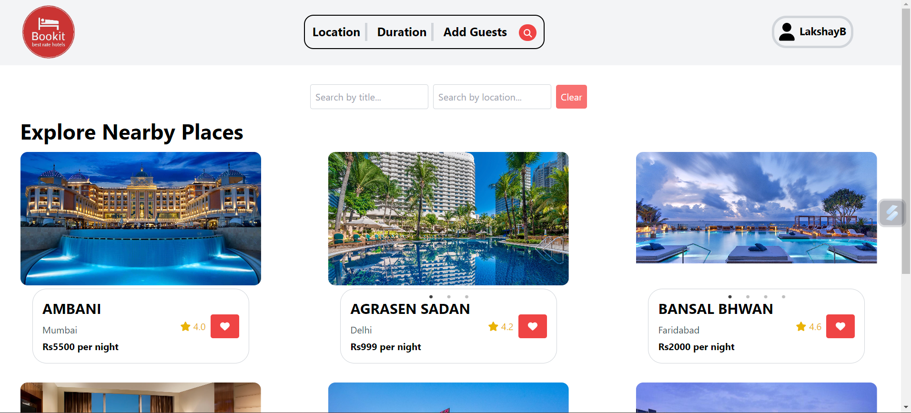

Welcome to our Hotel Booking Website! This platform allows users to discover and book hotels seamlessly. Below, you'll find information on how to set up the project, some screenshots to get a glimpse of the user interface, and instructions on how to add your own screenshots.

## Table of Contents

- [Getting Started](#getting-started)
- [Features](#features)
- [Screenshots](#screenshots)
- [How to Add Screenshots](#how-to-add-screenshots)
- [Contributing](#contributing)
- [License](#license)

## Getting Started

### Prerequisites

- Node.js: [Install Node.js](https://nodejs.org/)
- MongoDB: [Install MongoDB](https://www.mongodb.com/try/download/community)

### Installation

1. Clone the repository:

   ```bash
   git clone https://github.com/your-username/hotel-booking-website.git
   cd hotel-booking-website
   ```

2. Install dependencies:

   ```bash
   npm install
   ```

3. Set up environment variables:

   Create a `.env` file in the root directory and add your configuration:

   ```env
   MONGODB_URI=your_mongodb_connection_string
   JWT_SECRET=your_jwt_secret_key
   ```

4. Run the application:

   ```bash
   npm start
   ```

The application should be running at `http://localhost:3000`.

## Features

- User authentication and authorization
- Hotel discovery with detailed information
- Booking functionality with reservation management
- Searching hotel based on name and location
- Esily add new property

## Screenshots




...

## How to Add Screenshots

If you'd like to contribute additional screenshots:

1. Add your screenshots to the `screenshots` folder in the root directory of the project.
2. Update the README file to include your new screenshots, following the existing format.

## Contributing

Contributions are welcome! If you'd like to contribute, please follow these steps:

1. Fork the repository.
2. Create a new branch for your feature: `git checkout -b feature-name`.
3. Make your changes and commit them: `git commit -m 'Add new feature'`.
4. Push to the branch: `git push origin feature-name`.
5. Open a pull request.

## License

This project is licensed under the [MIT License](LICENSE).
```

